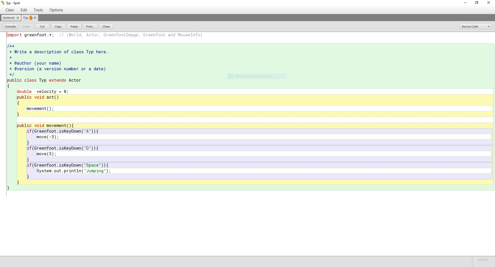
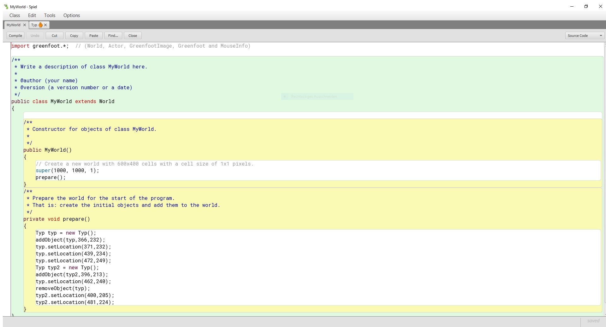
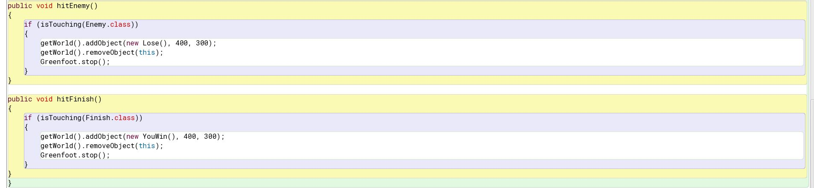
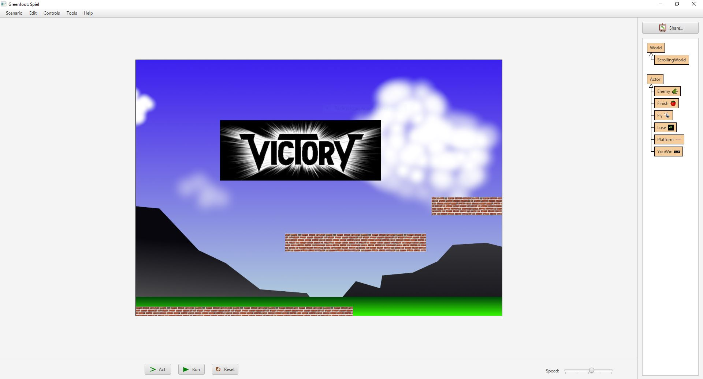
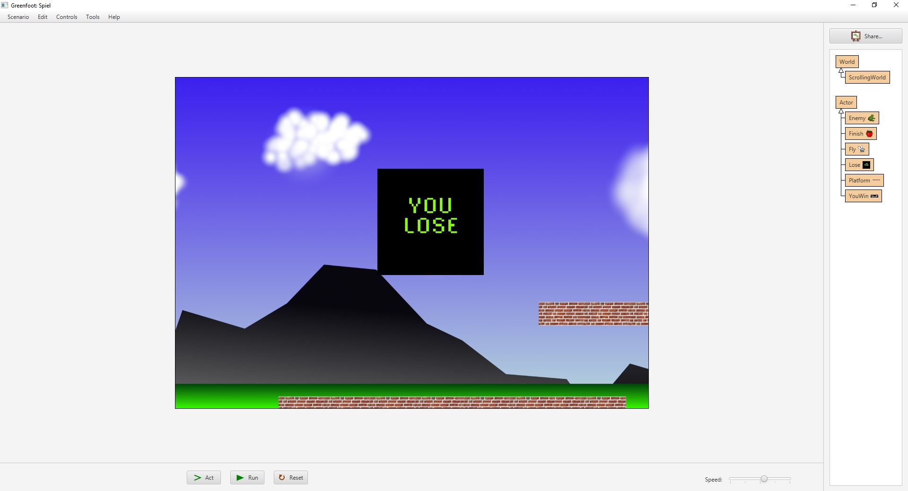
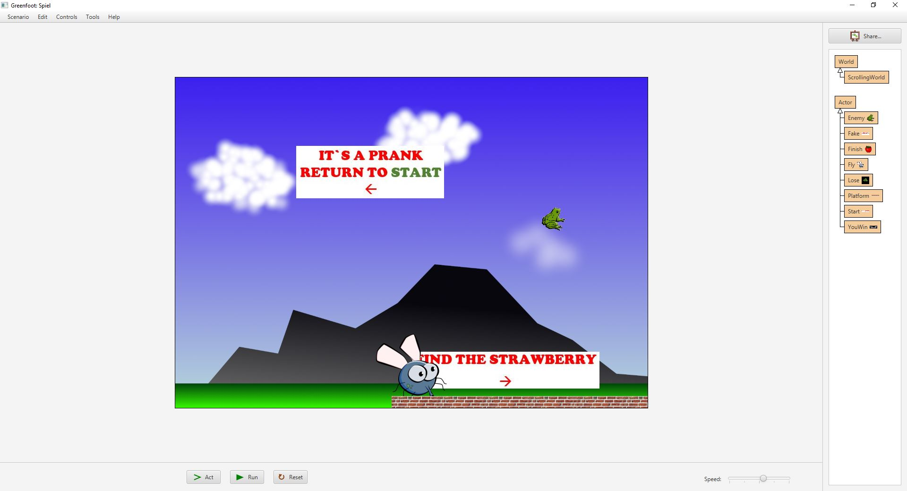
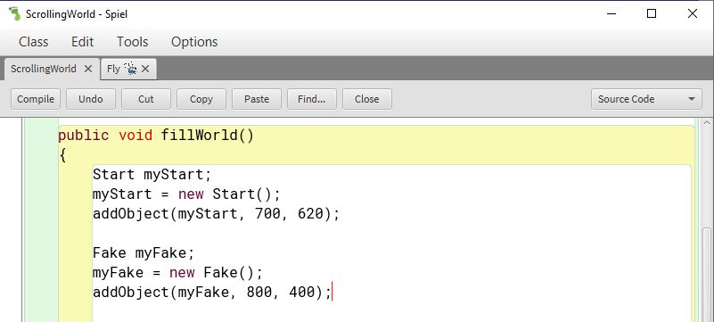

# Schulprojekt

## [1. Stunde, 16.08.2022](#1)
## [2. Stunde, 17.08.2022](#2)
## [3. Stunde, 23.08.2022](#3)
## [4. Stunde, 24.08.2022](#4)
## [5. Stunde, 30.08.2022](#5)
## [6. Stunde, 31.08.2022](#6)
## [7. Stunde, 06.09.2022](#7)
## [8. Stunde, 07.09.2022](#8)
## [9. Stunde, 13.09.2022](#9)
## [10. Stunde, 14.09.2022](#10)
## [11. Stunde, 27.09.2022](#11)
## [12. Stunde, 28.09.2022](#12)
## [13. Stunde, 26.10.2022](#13)
## [14. Stunde, 02.11.2022](#14)
## [15. Stunde, 08.11.2022](#15)
## [16. Stunde, 09.11.2022](#16)
## [17. Stunde, 16.11.2022](#17)
## [18. Stunde, 23.11.2022](#18)
## [19. Stunde, 29.11.2022](#19)
## [20. Stunde, 30.11.2022](#20)
## [21. Stunde, 06.12.2022](#21)
## [22. Stunde, 07.12.2022](#22)
## [23. Stunde, 13.12.2022](#23)
## [24. Stunde, 14.12.2022](#24)

###  Stunde vom 16.08.2022

In unserer ersten Informatikstunde mit Herrn Buhl, hat uns Herr Buhl seine Erwartungen an unseren Kurs geschildert. Danach hat er uns Mögliche Endresultate von früheren Projekten aus dem Informatikkurs gezeigt, wie z.B. ein regulierbarer und temperaturmessender Gaskocher https://www.youtube.com/watch?v=ZekT9gXA-Eo. Daraufhin wurde uns dann erklärt, wie wir einen GitHub Account unter https://github.com/ anlegen. 

###  Stunde vom 17.08.2022

Heute haben wir uns Grundlagen zu Markdown beigebracht, mit Hilfe eines Markdown Tutorial https://www.markdowntutorial.com/lesson/3/. Zu dem haben wir uns Gedanken darüber gemacht, was für ein Projekt wir, in diesem Halbjahr, verwirklichen wollen. 

###  Stunde vom 23.08.2022

Diese Informatikstunde haben wir mit dem Sammeln von möglichen Ideen für unser Projekt begonnen, dabei kam herum, dass wir einen Jump and Run Parkour kreieren wollen. Darauf hin haben wir uns dann daran gemacht die ersten Schritte in Greenfoot zu machen. Um eine Idee davon zu bekommen, wie wir einen Charakter in Greenfoot erstellen können, haben wir uns Hilfe auf Yt gesucht. Dort wurde uns erkärt wie wir unsere Person dazu bringen sich zu bewegen.

###  Stunde vom 24.08.2022

In dieser Doppelstunde haben wir unser Wissen aus der letzten Stunde dazu genutz, um unseren Charakter zu erschaffen und diesen sich bewegen zu lassen, wenn wir A oder D drücken. Jedoch hatten wir erst alles unter Downloads und nicht unter Desktop gespeichert, was wiederum zu Problemem führte, da es nicht so funktionierte wie wir es uns vorstellten. Deshalb haben wir alles nochmal neu angefangen,so dass es jetzt so aussieht.

 Unsere Steuerung

 

 

 
 

###  Stunde vom 30.08.2022
Heute waren wir leider beide krank und konnten somit nicht an unserem Projekt weiter arbeiten.

###  Stunde vom 31.08.2022
Am 31.08.2022 haben wir uns 1. damit beschäftigt, wie man einen Hintergrund in Greenfoot einfügt. Dafür haben wir Lasse und Joel gefragt, die uns da freundlicherweise weiterhelfen konnten. 2. Wir haben uns angeguckt wie man zwei Bilder einfügt.

###  Stunde vom 06.09.2022
In dieser Stunde war Liam leider nicht da,so dass ich alleine arbeiten musste. Da wir bereits davor abgesprochen hatten was wir in der nächsten Stunde machen wollen, hatte ich einfach mit unserem Plan weitergemacht. Also habe ich michdaran begeben heraus zu finden wie ich es schaffe einen Boden zu kreieren, auf dem man dann später laufen kann. Dafür habe ich mich folgender Quelle bedient https://www.youtube.com/watch?v=By8fojS0sIU . In diesem Video wurde mir erklärt wie ich einen Boden erschaffe, jedoch funktionierte das nicht so gut wie gedacht worauf hin ich mich an Hernn Buhl gewandt habe, der mir dann bei der Fehlersuche geholfen hat. Der Fehler war das ich die ("") in der Klammer vergessen hatte.

###  Stunde vom 07.09.2022

Am 07.09.2022 habe ich mich weiter mit dem Video aus der Stunde davor auseinander gesetzt und so dann Final einen Boden erstellt, auf dem unser Chrakter dann hoffentlich laufen kann.

###  Stunde vom 13.09.2022

Diese Informatikstunde haben wir damit begonnen, eine passende Erklärung zu finden, um die Schwerkraft in das Spiel zu integrieren. Dabei haben wir folgendes Video gefunden https://www.youtube.com/watch?v=By8fojS0sIU . Aufgrundelage dieses Videos haben wir uns dann daran begeben unseren Chrakter springen zu lassen. Dabei haben wir immer wieder unser skript geändert, jedoch zum Schluss sind wir erfolgreich zu einem Ende gekommen, sodass sich unser Charakter bewegte und dabei sprang.

###  Stunde vom 14.09.2022

Der 14.09.2022 brachte spannende neue Erkentnisse mit sich. So haben wir herausgefunden, dass wir unseren Charakter unterschiedlich schnell bewegen können, je nach dem wir das einstellen. Außerdem haben wir herausgefunden, wie wir einstellen wie hoch unser Charakter springt. 
Am Schluss waren wir so weit, dass wir unseren Charakter, wie in einem Spiel, so bewegen konnten wie wir es wollen. 
https://www.youtube.com/watch?v=SBcIb4_ST8I 

###  Stunde vom 27.09.2022

Heute haben wir uns mit Luca beraten und uns angeguckt wie er seine Welt kreiert hat. Auf seine Empfehlung hin, haben wir dann folgendes Video rausgesucht https://www.youtube.com/watch?v=FoD7cjW_5lU . Mithilfe von diesem Video werden wir in der nächsten Stunde, am Mittwoch den 28.09.2022, unsere Welt anpassen.

###  Stunde vom 28.09.2022

Der heutige Tag war ein großer Rückschlag für uns, denn bei dem Versuch weiterzukommen und es zu schaffen das sich unsere Welt bewegt, wenn wir mit unserer Figur nach Rechts oder Links laufen, haben wir es geschafft das wir nun gar keinen Hintergrund mehr haben. Hinzu kommt das unsere Welt verschwunden ist und es nicht so läuft,so  wie wir uns das vorgestellt haben. Zuguter letzt ist auch noch Greenfoot abgestürzt, sodass das was wir heute neu angefangen haben nicht gespeichert wurde. Jetzt haben  wir uns dazu entschieden, dass wir in der nächsten Stunde unsere Welt nochmal neu machen. Als einziger kleiner trost ist uns unsere Steuerung des Characters geblieben.

 
 alte Steuerung

 

 

 

###  Stunde vom 26.10.2022
In der ersten Stunde nach den Herbstferien, haben wir uns zuesrt damit beschäftigt, wie wir es schaffen das unser Charakter immer in die Richtung guckt in der er sich bewegt. Diese Information haben wir aus folgendem Video entnommen: https://www.youtube.com/watch?v=FoD7cjW_5lU. In der zweiten Stunde haben wir uns mit dem plazieren von Gegenständen beschäftigt, so dass sich diese nicht mit dem Charakter mitbewegen. Dabei war die Schwierigkeit, dass sich der Hintergrund bei uns bewegt und nicht der Charakter. Das bedeutet, dass sich die Gegenstände auch nicht bewegen, außer man gliedert sie in den Hinntergrund ein. Mit dem folgenden Video haben wir diese Informationen bekommen: https://www.youtube.com/watch?v=RQUYT9svlTg.

###  Stunde vom 02.11.2022
Nach dem die Stunde am 01.11.2022 aufgrund des Schulentwicklungtags ausgefallen ist, haben wir erst am 02.11.2022 weiter arbeiten können. In der Stunde haben wir uns dann damit auseinander gesetzt wie wir es schaffen können, dass unser Charakter springen kann und nicht durch die Welt fliegt, auch wenn es eine Fliege ist. Im folgenden Video wurde uns dann erklärt wie wir mit unserem Charakter springen können https://www.youtube.com/watch?v=z7RB-KSlCFQ. Um jedoch den neuen Code schreiben zu können, mussten wir zu vor erst einmal unsren alten Code löschen. Es resultierte daraus das sich jetzt unsere Welt nicht mehr mit bewegt. Das Problem wird dann in der nächsten Stunde angegangen.

###  Stunde vom 08.11.2022
Heute sind wir, wie bereits in der letzten Stunde besprochen, das Problem, mit unserer Welt, die sich nicht mitbewegt, angegangen. Dafür haben wir erst diverse Dinge selbst versucht, welche jedoch alle nicht Ziel führend waren. Am Ende der Stunde haben wir dann Herrn Buhl gefragt und ihn daraum gebeten uns weiter zu helfen. Nach einer kurzen Fehleranalyse hat er unseren Fehler gefunden und uns gezeigt wie man in behebt, sodass sich unser Character mit dem Hintergrund mitbewegem kann. 

###  Stunde vom 09.11.2022
In der ersten Stunde, von den beiden Stunden am 09.11.2022, haben wir uns damit auseinander gesetzt wie wir mit unser Projekt weiter fortfahren möchten und wie wir unsere weiteren Ideen (1. Ein Ziel, 2. Ein Gegner, wo wenn man mit dem in Kontakt kommt, dass Spiel zurück gesetzt wird) umsetzten können. Damit wir überhaupt wissen können, wie man ein Ziel und einen Gegner erschaftt, haben wir uns folgendes Video angeguckt und damit gearbeitet https://www.youtube.com/watch?v=DVrYb1VmGnE.

###  Stunde vom 16.11.2022
Heute haben wir uns angeguckt wie man einen Gegner in das Spiel hinzufügt. Dabei haben wir herausgefunden, dass wir irgend ein Bild nehmen können und dann einfach sagen nmüssen, dass wenn die Fliege das Bild berührt das Spiel vorbei ist (Game Over). Danach haben wir dann noch ein Ziel festgelegt, die Erdbeere. Das Ziel funktioniert genau nach dem gleichen Prinzip wie der Gegner, sodass wenn man die Erdbeere berührt ein Bild erscheint (Victory). Unseren Quellcode sowie die beiden Bilder sind unten zu sehen.

 
 Viktory und Game Over Bilder + der dazu gehörige Code

 

 
 ###  Stunde vom 23.11.2022
 In der heutigen Doppelstunde, haben wir uns mit Anweisungen, für den Spieler beschäftigt. Dazu haben wir ein Schild am Anfang eingefügt, was die Aufgabe der Fliege beschreibt. Das Bild was nachher bei dem Ende erscheinen soll, haben wir auch schon hinzugefügt. Der Spieler wird erst aufgefordert die Erdbeere zu suchen, um danach wieder ganz an Anfang gehen zu müssen, weil sich dort die Erdbeere befindet.

 
 Anweisungsschilder + der dazu gehörige Code

 

###  Stunde vom 29.11.2022
Da wir heute leide beide krank gewesen sind, konnten wir an unserem Projekt nicht weiter arbeiten

###  Stunde vom 30.11.2022
Die Stunde am 30.11.2022 ist leider ausgefallen. Daher konnten wir nicht an unserem Projekt weiter arbeiten, haben jedoch unseren Eintrag schon einmal, von zu Hause aus, überarbeitet.

###  Stunde vom 06.12.2022
Heute haben wir einige kleine Änderungen vorgenommen. Wir haben die Anweisungsschilder an ihren richtigen Platz gebracht und unser Ziel festgelegt. Hinzu kam das wir viele Ebenen in das Spiel hinzugefügt haben, welche auf unterschiedlichen Höhen und Weiten platziert wurden.

###  Stunde vom 07.12.2022
In dieser Doppelstunde haben wir unser Spiel fertig gestellt. Wir haben am Anfang die letzten Jump and Run Platformen platziert, um dann danach uns mit dem Enemy (die Frösche) zu beschäftigen, da kam nämlich immer eine Fehlermeldung. Die verwies uns darauf, dass etwas mit unserem Enemy nicht stimmt. Dabei ging es darum dasunter "Fly" bei "public void act" "hitEnemy" zwar als solches erkannt wurde, jedoch danach da noch stand "hitFinish", sodass das Spiel nach dem "hitEnemy" immer noch versucht hat "hitFinish" auszuführen, was natürlich nicht funktionierte. Das Problem konnten wir dann dadurch umgehen, das wir gesagt haben "public void hitSomething" und dann da reingeschrieben haben was passiert, wenn man den Frosch oder die Erbeere (Finish) berührt. Desweiteren haben wir gesagt das unser "Actor", die Fliege, verschwindet, wenn Sie entweder 1. Den Frosch berührt ode 2. die Erbeere.

###  Stunde vom 13.12.2022

Heute haben wir die letzten Änderungen vorgenommen, indem wir den Boden bishin zur Erdbeere verlängert haben, sodass diese nicht mehr in der Luft schwebt. Danach haben wir einen Testrun gestartet, um zu überprüfen ob das Spiel überhaupt funktioniert. Nach dem letzten Check, haben wir uns die Projektseiten von ehemaligen Schülern angeschaut, um uns für unsere eigene inspirieren zu lassen.

###  Stunde vom 14.12.2022

